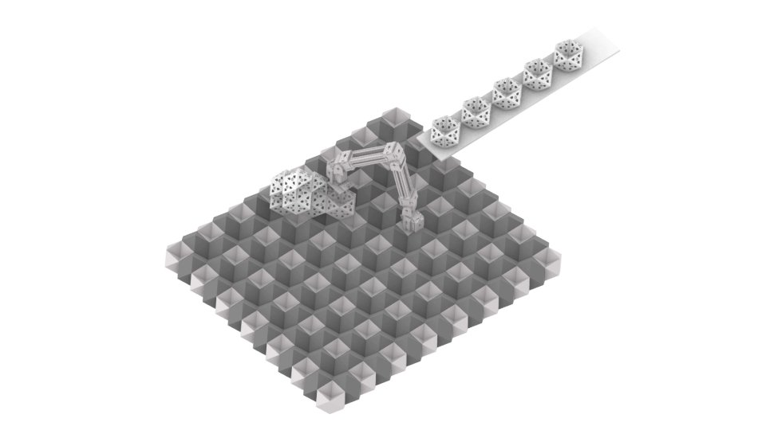
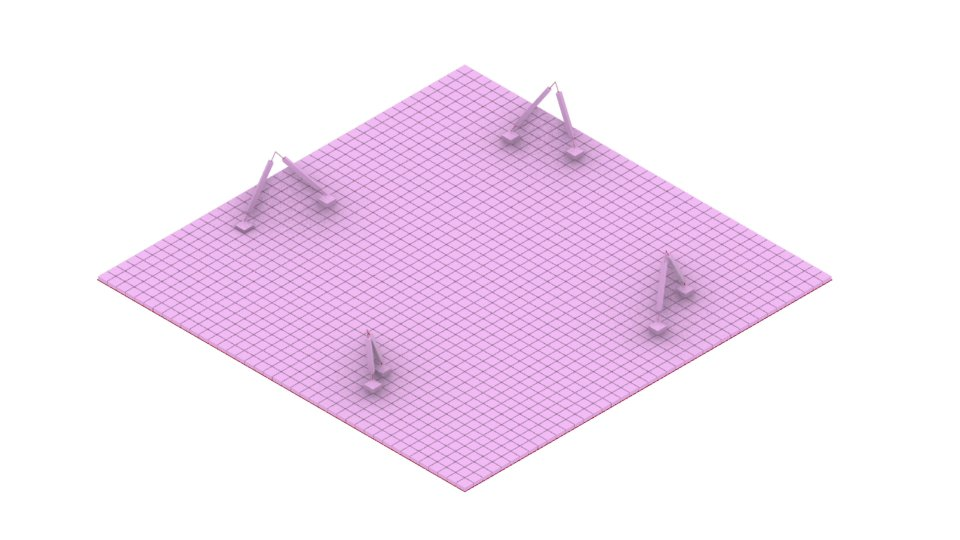

# Rhomb-E_RhomBlock_Construction

Repository containing 3D models, block geometries, robot CAD, Python
simulation scripts, Arduino firmware and supplementary materials for
the Rhomb-E & RhomBlock system.

This README covers the **motion-planning engine** specifically
(`rhombe_motion/`, `grasshopper/`, `tests/`); other materials in this
repository (3D models, CAD, firmware) are documented separately as
they are added.

## Demo (`demo/`)

### Videos

[](demo/Rhomb-E.mp4)

**▶ [`Rhomb-E.mp4`](demo/Rhomb-E.mp4) - the Rhomb-E robot picking up
and placing RhomBlocks on the lattice.** Click the image to watch it
directly in your browser, no download needed.

[](demo/Relative%20Robots%20CRC%20Work.mp4)

**▶ [`Relative Robots CRC Work.mp4`](demo/Relative%20Robots%20CRC%20Work.mp4)
- the parametric lattice/voxel grid on its own** (matches the starter
template below). Click the image to watch it directly in your browser,
no download needed.

### Grasshopper starter template

**[`Relative Robots.gh`](demo/Relative%20Robots.gh)** - a bare-bones
Grasshopper starter template. It contains only the generic parametric
lattice/voxel grid (the U/V/W point grid the rest of this project
builds on) - it does **not** include the Rhomb-E robot or RhomBlock
geometry. This is intentional: it is meant as an open starting point
so that anyone can plug in their own robot and block designs on top of
the same voxel-grid logic, instead of starting from a blank canvas.
Open it directly in Rhino 7/8's Grasshopper - it is self-contained and
parametric (adjust the sliders to change the grid's size/spacing), no
plugins required beyond Grasshopper itself.

## Rhomb-E Motion Engine

External Python motion-planning engine for **Rhomb-E**, a bipedal,
5-DOF relative construction robot that moves and builds on the
RhomBlock lattice (rhombic dodecahedral-hemi-octahedral units).
Grasshopper stays the visualization/UI layer; this library holds the
actual, independently testable kinematics and is imported into
Grasshopper through small `GhPython` bridge scripts.

See the accompanying paper: [*"Rhomb-E Relative Robots: A Collective
Construction System for Small Reversible Blocks"*](https://papers.cumincad.org/cgi-bin/works/paper/ecaade2026_520)
(eCAADe 2026).

### Status

Single-robot motion is the current focus: pick up a block, transport
it, place it, and return home, all while respecting the robot's real
physical constraints. Collective/multi-robot coordination and
reinforcement-learning-based planning are planned future stages, not
part of this repository yet.

### Architecture

```
rhombe_motion/
    primitives.py       A1-A3: lift/lower a foot, translate a foot,
                         rotate the support foot around an obstacle.
    behaviors.py         B1-B2: composed walking behaviors (move
                         forward with/without a carried block), plus
                         all foothold/collision/leg-span safety rules.
    work_sequences.py    D1-D3: composite pickup / place / return-home
                         sequences built on top of behaviors.py.
    simple_motion.py     Legacy reference implementation, kept only
                         for parity testing against the newer layers.

grasshopper/             GhPython bridge scripts - thin adapters that
                          import rhombe_motion and expose it to
                          Grasshopper inputs/outputs.

tests/                    Unit tests for every layer above.

tools/analyze_ghx.py      Standalone script to inspect a Grasshopper
                           .ghx export (component list, wiring).
```

### Physical constraints modeled

All of these are enforced by `rhombe_motion/behaviors.py` and covered
by the test suite:

- **Foothold color (checkerboard):** a foothold at `(u, v)` is
  white/no-load-only when `u` and `v` are both even, red/with-load-only
  when exactly one of `u, v` is odd, and not a valid foothold at all
  when both are odd.
- **Leg-span limit:** the two feet's `u`, `v`, and `w` coordinates may
  never differ by more than 5, independently per axis.
- **Minimum same-lane separation:** the two feet may never stand
  within 1 block of each other while sharing a row or column.
- **Placed-block clearance:** a placed stone blocks its own cell plus
  its immediate neighbors; a foot's post-placement stance needs at
  least 3 units of Manhattan distance from it.
- **Ground-contact invariant:** at every pose, at least one foot is at
  its own true ground-contact height - the two feet are never both
  airborne at once.
- **Occupied columns:** once a block is placed at a column, that
  column is tracked as permanently occupied and excluded from every
  future foot-landing search (see `complete_assembly_cycle`'s
  `occupied` parameter).

### Running the tests

```bash
python -m unittest discover -s tests -v
```

### Using it from Grasshopper

Each script in `grasshopper/` is meant to be pasted into a GhPython
component. They all take a `project_path` input (this repository's
root) and a `reload_code` boolean toggle - flip it to `True` after
editing the Python source so Grasshopper picks up the change (modules
are reloaded in dependency order: `primitives` -> `simple_motion` ->
`behaviors` -> `work_sequences`).

`grasshopper/assembly_cycle_test_bridge.py` is the most complete
example: it drives a full pickup -> transport -> place -> return cycle
and exposes `isCarrying_out` / `stonePlaced_out` toggles for driving
the carried/placed block's visibility, plus `occupiedU_out` /
`occupiedV_out` to chain multiple placements in the same build.

### License

The motion-engine code (`rhombe_motion/`, `grasshopper/`, `tests/`,
`tools/`) is MIT-licensed - see [LICENSE](LICENSE).
